## Introduction: NBA

NBA, the National Basketball Association, is a professional basketball
league in the United States. The league is composed of 32 teams, each of
which competes for Conference Championship. The NBA is the most popular
sport in the United States, with over 100 million people watching it
every year. As of the time writing this article, the NBA is currently in
its playoffs, and the final four teams are the **Golden State
Warriors**, **Boston Celtics**, **Miami Heat**, and **Dallas
Mavericks**.

Started in the year of 1946, there had been a lot of great players, here
are some NBA players that the author like the most:

### Lebron James

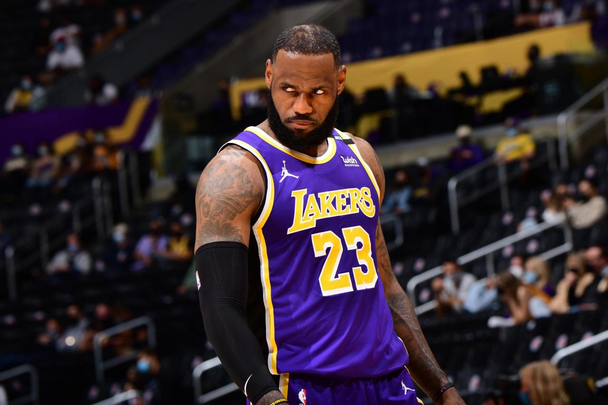

As of 2022, 37-year-old Lakers player Lebron James has won:

-   4x NBA champion (2012, 2013, 2016, 2020)
-   4x NBA Finals MVP (2012, 2013, 2016, 2020)
-   4x NBA Most Valuable Player (2009, 2010, 2012, 2013)
-   18x NBA All-Star (2005-2022)
-   3x NBA All-Star Game MVP (2006, 2008, 2018)
-   13x All-NBA First Team (2006, 2008-2018, 2020)

### Russel Westbrook

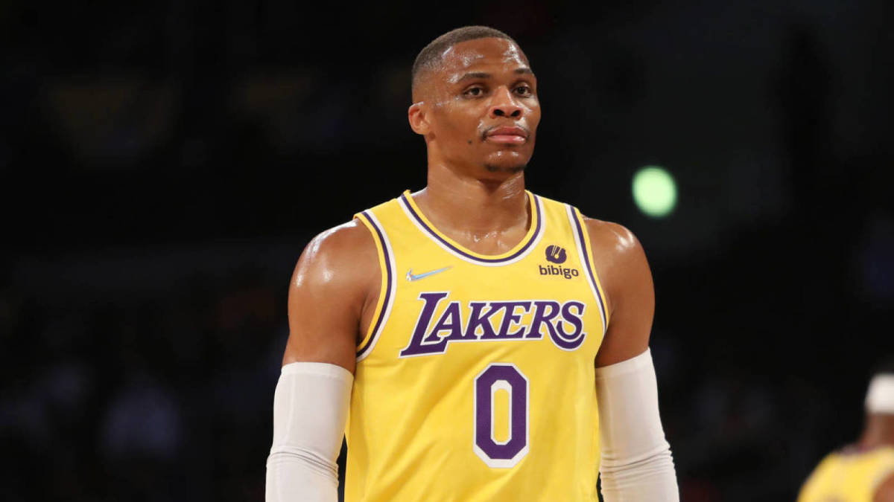

As of 2022, 33-year-old Lakers point guard Russel Westbrook has won:

-   NBA MVP (2017)
-   9x NBA All-Star (2011-2013, 2015-2020)
-   2x All-NBA First Team (2016, 2017)

## Motivation

On August 6, 2021, Westbrook was traded to the Los Angeles Lakers. As
his first season with the Lakers progressed, Westbrook received
criticism for his perceived poor quality of play. Westbrook shot 30
percent from the three-point line and turned the ball over 4.6 times per
game through early January, and he received criticism for a particular
game against the Minnesota Timberwolves where he turned the ball over
nine times. Westbrook later responded to critics, saying that they were
only looking at the stat sheet and not his overall play on the court.

However, Westbrook also had some remarkable games during the season. On
January 4, 2022, in a 122-114 win over the Sacramento Kings, Westbrook
had his first game without turnovers since March 14, 2016. On January
29, in a 114-117 loss to the Charlotte Hornets, he scored 35 points, of
which 30 in the second half (16 points in the fourth quarter from a
20-point deficit) were the most by any Laker since Kobe Bryant’s last
game on April 13, 2016.

Different people had different opinions on Westbrook’s performance. Many
Laker’s fan want to trade Westbrook badly, while others feel that
Westbrook is still good for the Lakers.

**So the key question arises: Is Westbrook a good player in the 2021-22
season?**

To answer this question we shall introduce another statistics: **2k
ratings**. Each year, 2k, a gaming company, releases a version of NBA
video game that consist of all the players in the NBA. And base on the
performance of each player, 2k assigns a **rating** to each player. The
rating is an integer between 0 and 100. The higher a player’s rating,
the better a player is. For example, the rating of Lebron James in
2016-17 Season is 99, and the rating of Russell Westbrook in the same
season is 93. A typical starter player will have a rating of \~80+, and
a typical bench player will have a rating of \~70+.

For this case study, we **assume the fact that each player’s 2k rating
is unbiased.** So to answer our case study question, we will use our
model to predict the rating of Westbrook, base on his performance at the
current season. If the rating is satisfactory, we can conclude that
Westbrook is still a good player this season. If not, then we can
conclude that Westbrook is not a good player this season.

### An Overview of Dataset

The dataset is downloaded as a csv file and is obtained from a [kaggle
dataset by William
Yu](https://www.kaggle.com/datasets/willyiamyu/nba-2k-ratings-with-real-nba-stats).

While a full copy of the codebook is available in my zipped files, here
are some of the key variables that are helpful to be aware of for this
report:

-   `PLAYER`: The name of the player
-   `TEAM`: The name of the team
-   `ratings`: The 2k rating of the player
-   `GP`: The number of games played
-   `MIN`: The number of minutes played
-   `PTS`: The number of points scored
-   `AST`: The number of assists
-   `REB`: The number of rebounds
-   `STL`: The number of steals
-   `BLK`: The number of blocks
-   `TOV`: The number of turnovers
-   `PF`: The number of personal fouls
-   `FG%`: The percentage of field goals made
-   `3P%`: The percentage of three pointers made
-   `FT%`: The percentage of free throws made

### Loading Data and Packages

In this section, We will install some packages for data analysis.

``` r
library(ggplot2)
library(tidymodels)
library(corrplot)
library(ggthemes)
library(yardstick)
library(tidyverse)
library(lubridate)
library(tidymodels)
library(corrr)
tidymodels_prefer()

setwd("/Users/teo/Documents/UCSB/Spring 2022/PSTAT 131/PSTAT 131/pstat131-project")
set.seed(1205)
```

Then, we read the dataset.

``` r
ratings <- read.csv(file = 'data/nba_rankings_2014-2020.csv')
```

``` r
dim(ratings)
```

    ## [1] 2412   32

So we see that there are 2412 observations and 32 columns in total.

## Exploratory Data Analysis

### Teams

``` r
ggplot(ratings, aes(TEAM)) +
  geom_bar() +
  labs(
    title = "Count of NBA Players by Team",
    x = "Teams",
    y = "Players Count"
  ) +
  # We want to be able to read labels better
  coord_flip()
```

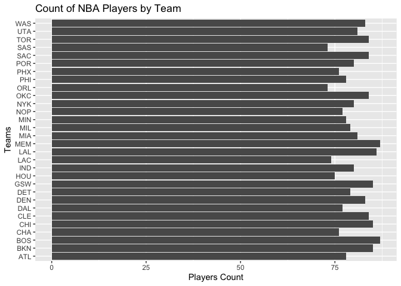

So we see that over these years each team has about the same number of
players. This makes sense because each NBA team has a minimum player
number requirement each year.

### Ratings

Let’s examine `ratings` closely.

#### Histogram of Player Rating by Season

``` r
ggplot(ratings, aes(rankings)) +
  geom_histogram(bins = 30, color = "white") +
  facet_wrap(~SEASON, scales = "free_y") +
  labs(
    title = "Histogram of Player Ratings by Season"
  )
```

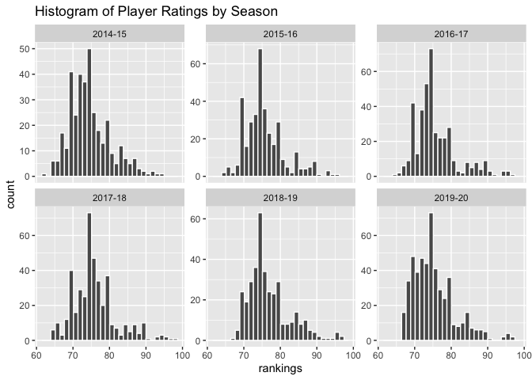

This tells us that the distribution of ratings for all years are right
skewed. This means that most players in the NBA have a rating of 60-70,
and only a few excellent NBA player can reach a rating of 80+. We also
see a trend, across recent years, that there are less and less top
players reaching a rating of 90.

#### Ratings in each team by Season

``` r
ggplot(ratings, aes(reorder(TEAM, rankings), rankings)) +
  geom_boxplot(varwidth = TRUE) + 
    facet_wrap(~SEASON, scales = "free_y") +
  coord_flip() +
  labs(
    title = "Ratings in each team by Season",
    x = "Team Name"
  )
```

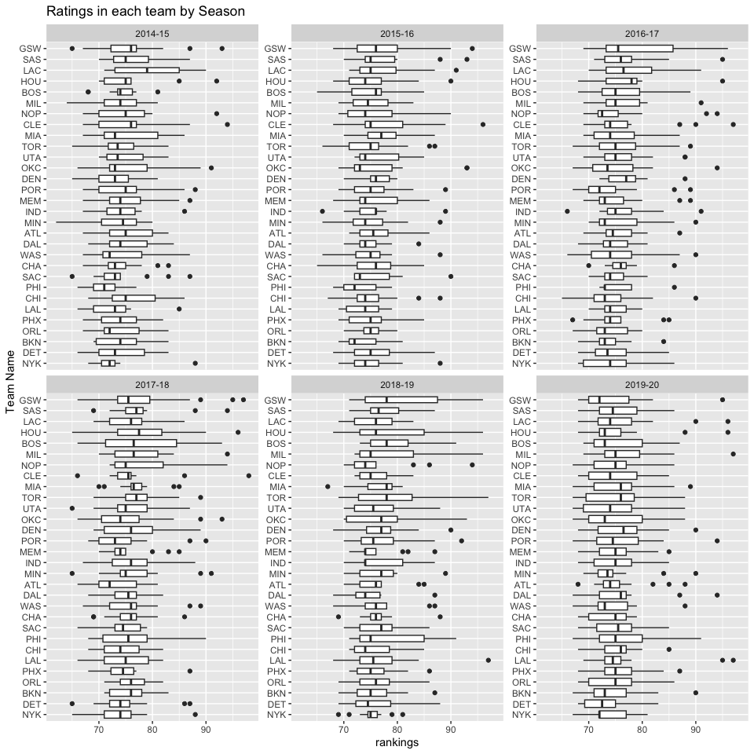

The above plot shows how the ratings of players in a team is
distributed. And we can make sense of it case by case.

##### 2015-16 Golden State Warriors

As a matter of fact, the Golden State Warriors Won the NBA Championship
in the 2015-16 Season. From the above diagram, we see clearly that the
distribution of their player ratings is clearly higher than other teams.
The best player on the team, Stephen Curry, was a outlier of player
rating on the diagram.

##### 2016-17 Cleveland Cavaliers

In the 2016-17 Season, the Cleveland Cavaliers got a legendary comback
on the NBA finals. They were down 1-3 agianst the Golden State Warriors,
but they won consecutively 4 games and claimed the title. We see that,
on the above chart, The Golden State Warriors as a good range of good
players, and most players on Cleveland Cavaliers are rated \~70.
Clearly, the Golden State Warriors was a better team on this season. The
Cavaliers led by Lebron James, Kevin Love, and Kyrie Irving won the
championship make them a classic team in the history of NBA.

#### Rankings vs. PTS by Season

Looking at the player ratings vs. the average game point of that player
across all season, we spot that there is some good linear relationshp
between these two variables. So one can conclude that the higher points
a player can score in a game, the higher ratings a get, and hence a
better player he is. This makes sense.

``` r
ratings %>% 
  ggplot(aes(PTS, rankings)) +
  geom_point(alpha = 0.1) +
  stat_summary(fun = mean, colour="red", geom="line", size = 3)+
  facet_wrap(~SEASON, scales = "free") +
  labs(
    title = "Ratings vs. PTS by Season"
  )
```

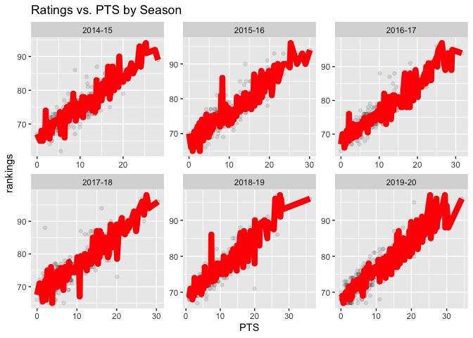

#### Ratings vs. Rebounds by Season

However, is rebounds positively correlated to a players’s ratings.
Applying the same mechanism above,

``` r
ratings %>% 
  ggplot(aes(REB, rankings)) +
  geom_point(alpha = 0.1) +
  stat_summary(fun = mean, colour="red", geom="line", size = 3)+
  facet_wrap(~SEASON, scales = "free") +
  labs(
    title = "Rankings vs. Rebounds by Season"
  )
```

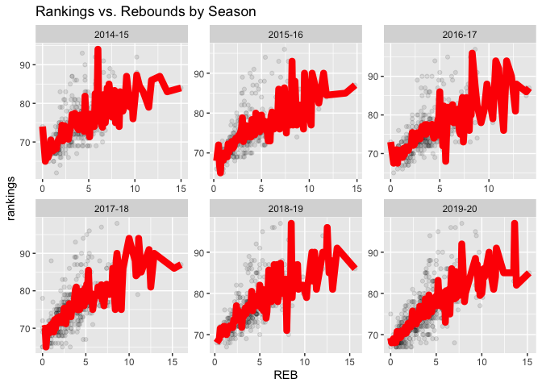

we see that The linear relationship is not that strong, meaning that
even though some player can grab a lot of rebounds, this does not make
them a good player.

#### Ratings vs. Turnovers by Season

The last thing we want to investigate is turnovers. We know that
turnovers are bad, but does more turnovers makes a player a bad player?

``` r
ratings %>% 
  ggplot(aes(TOV, rankings)) +
  geom_point(alpha = 0.1) +
  stat_summary(fun = mean, colour="red", geom="line", size = 3)+
  facet_wrap(~SEASON, scales = "free") +
  labs(
    title = "Ratings vs. Turnovers by Season"
  )
```

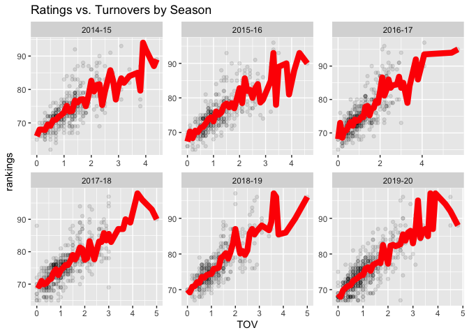

We see that, in fact, turnovers are quite positively corelated with
ratings. In our case, Westbrook is known for his turnovers, so maybe he
turn out to be a great player with our model prediction.

#### Correlation Matrix

We can also use a correlation plot to see how each variables are
correlated

``` r
library("dplyr")
cor_ratings <- select_if(ratings,is.numeric) %>% correlate()
rplot(cor_ratings)
```

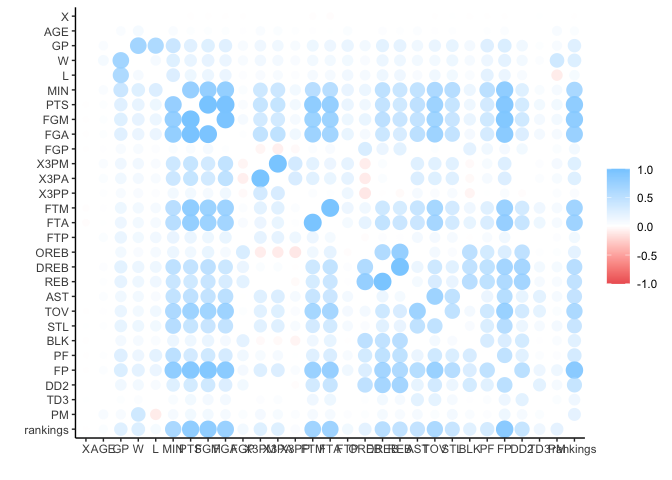

From the above correlation matrix, a interesting pattern came to me,
which is that all variables in this dataset has some degrees of positive
correlation. We shall investigate this in our following section.

## Modeling

### Random Forest

Since the model is downloaded on Kaggle and everything is cleaned up,
there is no need to do extra data cleaning. Since we found some obvious
linear relationships from our exploratory data analysis, we will first
attempt to fit a Random Forest model.

We turn `SEASON` and `TEAM`, into a factor, as we read the data.

``` r
ratings <- read.csv(file = 'data/nba_rankings_2014-2020.csv') %>%
  mutate(TEAM = factor(TEAM))
```

#### Data Split

The data was split in a 80% training, 20% testing split.

``` r
ratings_split <- ratings %>% initial_split(prop = 0.8)

ratings_train <- training(ratings_split)
ratings_test <- testing(ratings_split)
```

We also fold the data in 5 folds, this will be used for our tuning and
cross validation process.

``` r
ratings_folds <- vfold_cv(ratings_train, v = 5)
```

Now we create a random forest specification, we tune `mtry`, `trees`,
and `min_n`. We let `levels = 5` so that the training would not take too
much of time. We next specify a grid for tuning, as we can see from the
code below, `mtry` is ranged from 1 to 20, `trees` is ranged from 100 to
2000, and `min_n` is ranged from 1 to 20. We next create a workflow
adding our specification and formula into it.

``` r
rand_tree_spec <- rand_forest(
  mode = "regression",
  mtry = tune(),
  trees = tune(),
  min_n = tune()
) %>%
set_engine("ranger") 

rand_tree_grid <- grid_regular(mtry(c(1,20)),trees(c(100,2000)),min_n(c(1,20)),levels = 5)

rand_tree_wf <- workflow() %>%
  add_model(rand_tree_spec) %>%
  add_formula(rankings ~ TEAM + AGE + GP + W + L + MIN + PTS + FGM + FGM + FGA
   + FGP + X3PM + X3PA + X3PP + FTM + FTA + FTP + OREB + DREB + REB + AST 
   + TOV + STL + BLK + PF + FP + DD2 + TD3 + PM)
```

and we tune the model, plotting the tuning results.

``` r
library(ranger)
rand_tune_res <- tune_grid(
  rand_tree_wf, 
  resamples = ratings_folds, 
  grid = rand_tree_grid, 
)
 
autoplot(rand_tune_res)
```


From the above tuning results, we see that in general higher number of
`trees` and `mtry` yields better results. We then find the best model
with the following code.

``` r
best_rand_forest <- select_best(rand_tune_res)

rand_tree_final <- finalize_workflow(rand_tree_wf, best_rand_forest)

rand_tree_final_fit <- fit(rand_tree_final, data = ratings_train)

rand_tree_final_fit %>% extract_fit_engine()
```

    ## Ranger result
    ## 
    ## Call:
    ##  ranger::ranger(x = maybe_data_frame(x), y = y, mtry = min_cols(~20L,      x), num.trees = ~1050L, min.node.size = min_rows(~1L, x),      num.threads = 1, verbose = FALSE, seed = sample.int(10^5,          1)) 
    ## 
    ## Type:                             Regression 
    ## Number of trees:                  1050 
    ## Sample size:                      1929 
    ## Number of independent variables:  28 
    ## Mtry:                             20 
    ## Target node size:                 1 
    ## Variable importance mode:         none 
    ## Splitrule:                        variance 
    ## OOB prediction error (MSE):       3.537665 
    ## R squared (OOB):                  0.8934689

We will do our fitting on the testing data at the next section. But on
the training data,

``` r
final_rand_model = augment(rand_tree_final_fit, new_data = ratings_train)
bind_rows(
  rmse(final_rand_model, truth = rankings, estimate = .pred),
  rsq(final_rand_model, truth = rankings, estimate = .pred))
```

    ## # A tibble: 2 × 3
    ##   .metric .estimator .estimate
    ##   <chr>   <chr>          <dbl>
    ## 1 rmse    standard       0.691
    ## 2 rsq     standard       0.986

The RMSE is pretty low and the R-squared is pretty high. which means
that our model is pretty good on the training set. We will investigate
its performance on the testing data next section

### Boosted trees

In this subsection, we will attempt to fit a boosted tree model on the
dataset, similar to the previous one, we will first create a
specification, and then tune the model.

``` r
boost_tree_spec <- boost_tree(mtry = tune(), trees = tune(),min_n = tune()) %>%
  set_engine("xgboost") %>%
  set_mode("regression")

boost_tree_grid <- grid_regular(mtry(c(1,20)),trees(c(100,2000)),min_n(c(1,20)),levels = 5)

boost_tree_wf <- workflow() %>%
  add_model(boost_tree_spec) %>%
  add_formula(rankings ~ TEAM + AGE + GP + W + L + MIN + PTS + FGM + FGM + FGA
   + FGP + X3PM + X3PA + X3PP + FTM + FTA + FTP + OREB + DREB + REB + AST 
   + TOV + STL + BLK + PF + FP + DD2 + TD3 + PM)

boost_tune_res <- tune_grid(
  boost_tree_wf, 
  resamples = ratings_folds, 
  grid = boost_tree_grid,
)
 
autoplot(boost_tune_res)
```

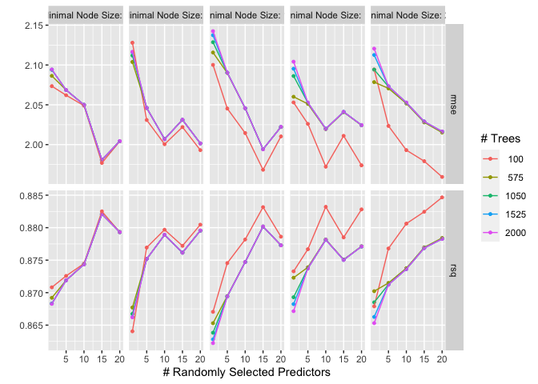

Looking at the tunining plot of the boosted tree, interestingly, the
`rmsq` and `rsq` do not converge as `trees` and `mtry` or `min_n`
increases. And again, We then find the best model with the following
code.

``` r
best_boost_tree <- select_best(boost_tune_res)

boost_tree_final <- finalize_workflow(boost_tree_wf, best_boost_tree)

boost_tree_final_fit <- fit(boost_tree_final, data = ratings_train)
```

For the boosted tree model,

``` r
final_boost_model = augment(boost_tree_final_fit, new_data = ratings_train)
bind_rows(
  rmse(final_boost_model, truth = rankings, estimate = .pred),
  rsq(final_boost_model, truth = rankings, estimate = .pred))
```

    ## # A tibble: 2 × 3
    ##   .metric .estimator .estimate
    ##   <chr>   <chr>          <dbl>
    ## 1 rmse    standard       0.759
    ## 2 rsq     standard       0.983

For the boosted tree model, the `rmse` is strikingly low and `rsq` is
strikingly high. This may be due to some overfitting, and we will
investigate this in the next section

### K Nearest Neighbors

In this subsection, we will attempt to fit a k-nearest neighbors on the
dataset, similar to the previous one, we will first create a
specification, and then tune the model.

``` r
library(kknn)
recipe <- 
  recipe(formula = rankings ~ TEAM + AGE + GP + W + L + MIN + PTS + FGM + FGM + FGA
   + FGP + X3PM + X3PA + X3PP + FTM + FTA + FTP + OREB + DREB + REB + AST 
   + TOV + STL + BLK + PF + FP + DD2 + TD3 + PM, data = ratings_train) %>% 
  step_novel(all_nominal_predictors()) %>% 
  step_dummy(all_nominal_predictors()) %>% 
  step_zv(all_predictors()) %>% 
  step_normalize(all_predictors())
knn_model <- 
  nearest_neighbor(
    neighbors = tune(),
    mode = "regression") %>% 
  set_engine("kknn")

knn_workflow <- workflow() %>% 
  add_model(knn_model) %>% 
  add_recipe(recipe)
```

Unlike the previous tree models, we are only turning number of neighbors

``` r
knn_params <- parameters(knn_model)

knn_grid <- grid_regular(knn_params, levels = 10)

knn_tune <- knn_workflow %>% 
  tune_grid(
    # what will it fit the workflow to
    resamples = ratings_folds, 
    # how does it complete the models in those workflows
            grid = knn_grid)
autoplot(knn_tune)
```

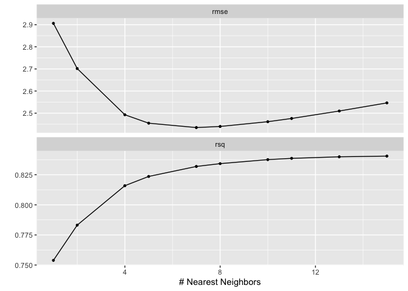

We can see from the above tuning plot, `rmse` reached a local minimum at
8, and `rsq` seem to increase as number of nearest neighbors increases.
Next, we will find the best model.

``` r
best_knn <- select_best(knn_tune)

knn_final <- finalize_workflow(knn_workflow, best_knn)

knn_final_fit <- fit(knn_final, data = ratings_train)
```

For our k-nearest neighbor model,

``` r
final_knn_model = augment(knn_final_fit, new_data = ratings_train)
bind_rows(
  rmse(final_knn_model, truth = rankings, estimate = .pred),
  rsq(final_knn_model, truth = rankings, estimate = .pred))
```

    ## # A tibble: 2 × 3
    ##   .metric .estimator .estimate
    ##   <chr>   <chr>          <dbl>
    ## 1 rmse    standard       1.36 
    ## 2 rsq     standard       0.951

The `rmse` is pretty low and the `rsq` is pretty high. which means that
our model is pretty good on the training set. We will investigate its
performance on the testing data next section

### Lasso regression

In this subsection, we will attempt to fit a lasso regression on the
dataset, similar to the previous one, we will first create a
specification, and then tune the model. As we can see from the recipe,
we are normalizing to predictors and made the nominal predictors dummy.
We are using the `glmnet` engine to perform the regression.

``` r
lasso_recipe <- 
  recipe(formula = rankings ~ TEAM + AGE + GP + W + L + MIN + PTS + FGM + FGM + FGA
   + FGP + X3PM + X3PA + X3PP + FTM + FTA + FTP + OREB + DREB + REB + AST 
   + TOV + STL + BLK + PF + FP + DD2 + TD3 + PM, data = ratings_train) %>% 
  step_novel(all_nominal_predictors()) %>% 
  step_dummy(all_nominal_predictors()) %>% 
  step_zv(all_predictors()) %>% 
  step_normalize(all_predictors())

lasso_spec <- 
  linear_reg(penalty = tune(), mixture = 1) %>% 
  set_mode("regression") %>% 
  set_engine("glmnet") 

lasso_workflow <- workflow() %>% 
  add_recipe(lasso_recipe) %>% 
  add_model(lasso_spec)
```

While we are doing a different kind of regularization, we still use the
same penalty argument. We’ve picked a different range for the values of
penalty, since we know it will be a good range. You would, in practice,
have to search a wide range of values at first, then narrow in on a
range of interest.

``` r
penalty_grid <- grid_regular(penalty(range = c(-2, 2)), levels = 50)
tune_res <- tune_grid(
  lasso_workflow,
  resamples = ratings_folds, 
  grid = penalty_grid
)

autoplot(tune_res)
```


We can see from the above tuning diagram. `rmse` increases as the amount
of regularizaiton increases. And `rsq` decreases as the amount of
regularization increases. Similar to what we have done to other models,
we will choose a best model.

``` r
best_penalty <- select_best(tune_res, metric = "rsq")
lasso_final <- finalize_workflow(lasso_workflow, best_penalty)

lasso_final_fit <- fit(lasso_final, data = ratings_train)
```

Now, for our lasso model,

``` r
final_lasso_model = augment(lasso_final_fit, new_data = ratings_train)
bind_rows(
  rmse(final_lasso_model, truth = rankings, estimate = .pred),
  rsq(final_lasso_model, truth = rankings, estimate = .pred))
```

    ## # A tibble: 2 × 3
    ##   .metric .estimator .estimate
    ##   <chr>   <chr>          <dbl>
    ## 1 rmse    standard       1.86 
    ## 2 rsq     standard       0.896

So the model also did well.

### Fit Results

#### RMSE

Now we look at the performance of these four models. We first look at
the `rmse` of each models

``` r
final_rand_model = augment(rand_tree_final_fit, new_data = ratings_test)
final_knn_model = augment(knn_final_fit, new_data = ratings_test)
final_lasso_model = augment(lasso_final_fit, new_data = ratings_test)
final_boost_model = augment(boost_tree_final_fit, new_data = ratings_test)

results_rmse <- bind_rows(
  rmse(final_rand_model, truth = rankings, estimate = .pred),
  rmse(final_knn_model, truth = rankings, estimate = .pred),
  rmse(final_lasso_model, truth = rankings, estimate = .pred),
  rmse(final_boost_model, truth = rankings, estimate = .pred) 
)
results_rmse
```

    ## # A tibble: 4 × 3
    ##   .metric .estimator .estimate
    ##   <chr>   <chr>          <dbl>
    ## 1 rmse    standard        2.05
    ## 2 rmse    standard        2.62
    ## 3 rmse    standard        2.13
    ## 4 rmse    standard        2.18

A low RMSE value indicates that the simulated and observed data are
close to each other showing a better accuracy. Thus lower the RMSE
better is model performance. The RMSE is a good measure for evaluating
the performance of a model because RMSE is proportional to the observed
mean. Interestingly, the random forest have the lowest rmse on the
testing set. For our boosted tree model, even though it performed super
good on the training set, on the testing set it was not as good as the
ramdom forest, this means that there is some degree of **overfitting**
in our boosted tree model.

#### RSQ

Another metric to look at is `rsq`, for our models,

``` r
results_rsq <- bind_rows(
  rsq(final_rand_model, truth = rankings, estimate = .pred),
  rsq(final_knn_model, truth = rankings, estimate = .pred),
  rsq(final_lasso_model, truth = rankings, estimate = .pred),
  rsq(final_boost_model, truth = rankings, estimate = .pred) 
)
results_rsq
```

    ## # A tibble: 4 × 3
    ##   .metric .estimator .estimate
    ##   <chr>   <chr>          <dbl>
    ## 1 rsq     standard       0.881
    ## 2 rsq     standard       0.816
    ## 3 rsq     standard       0.872
    ## 4 rsq     standard       0.865

Again, we have the random forest model with the lowest rsq on the
testing set. So we will use ramdom forest model to draw our conclusion!

## Conclusion

Remember that our goal was to answer this ultimate question,

**So the key question arises: Is Westbrook a good player in the 2021-22
season?**

Now, we will find out!

We have Some statistics of Westbrook’s 2021-22 season. We will use these
statistics to answer this question. We enter Westbrook’s statistics as a
tibble, and then predict with our model

``` r
westbrook <- tibble(TEAM = 'LAL', AGE = 33, GP = 78,SEASON = '2021-22', W = 33, L = 49, MIN = 34.3,PTS = 18.5,
FGM = 7.0, FGA = 15.8, FGP = 44.4, X3PM = 1.0, X3PA = 3.4, X3PP = 29.8, FTM = 3.4, FTA = 5.1, FTP = 66,
OREB = 1.4, DREB = 6.0, REB = 7.4, AST = 7.1, TOV = 3.8, STL = 1.0,BLK = 0.3, PF = 3.0, FP = 37.8, DD2= 28,TD3 = 10, PM = -2.7)

predict(rand_tree_final_fit, new_data = westbrook)
```

    ## # A tibble: 1 × 1
    ##   .pred
    ##   <dbl>
    ## 1  84.1

So the predicted value of Russel Westbrook is 84. So According to our
analysis, Westbrook is still a good player based solely on his
statistics of this season.

Okay, but what is Westbrook, actual rating? We look at the 2k ratings
database, Westbrook’s rating was 86 at the time the game was lauched and
dropped to 78 as of today. Since our data was only from 2014-2020, we
can see that our model’s prediction is reasonable.
